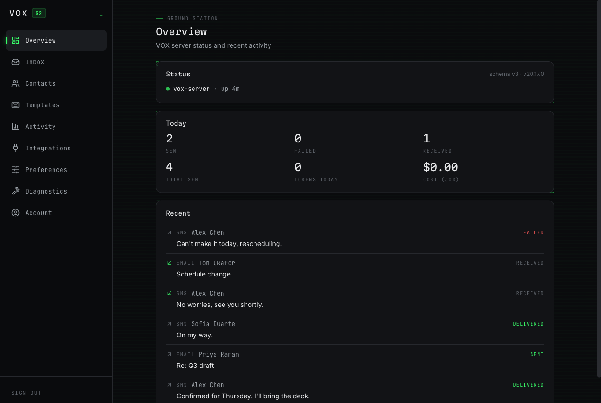
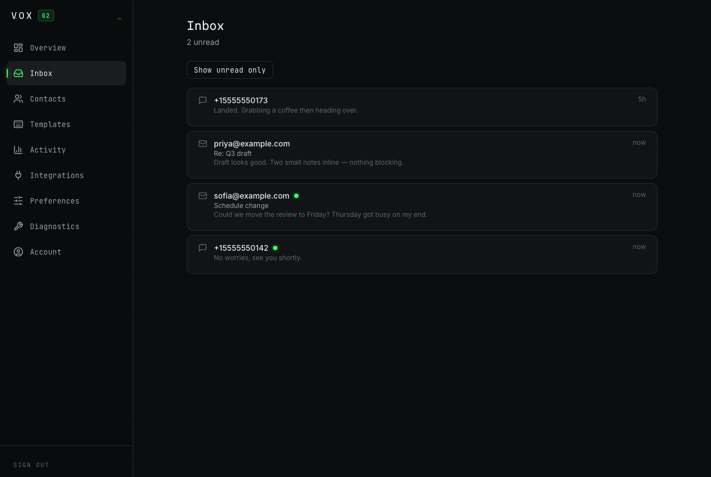
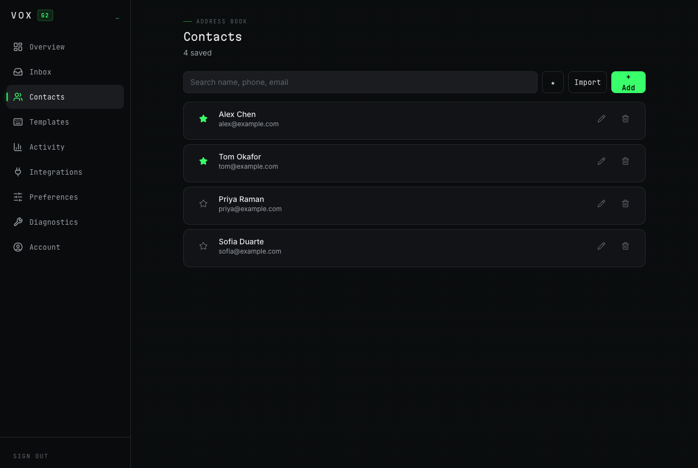
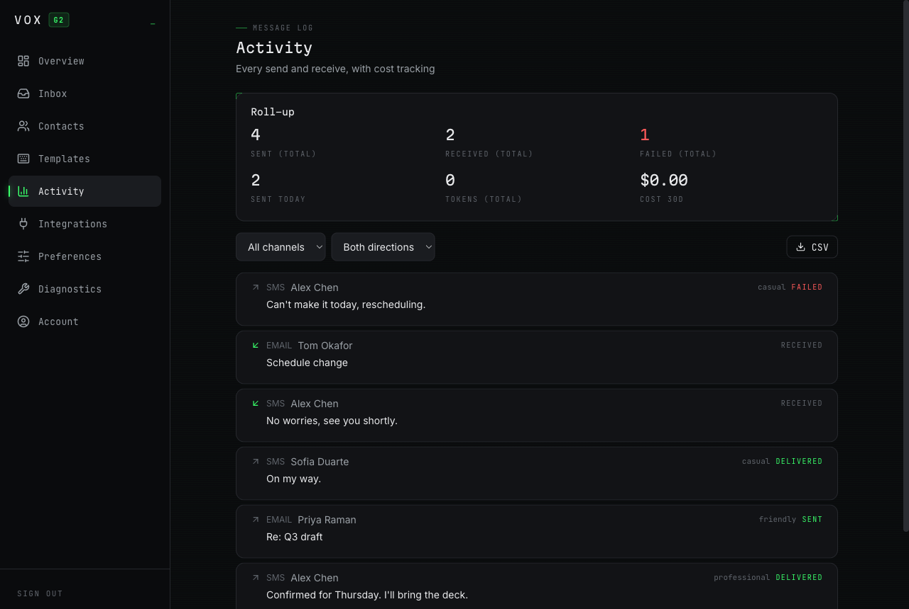
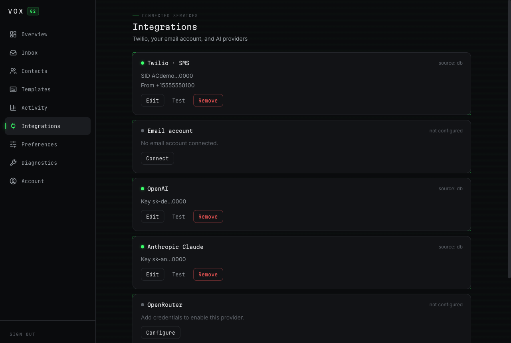
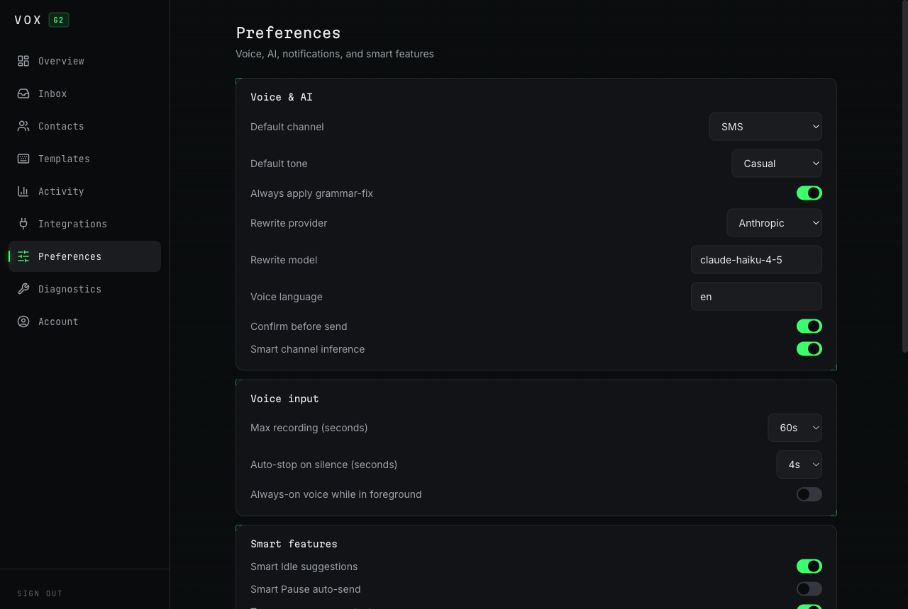
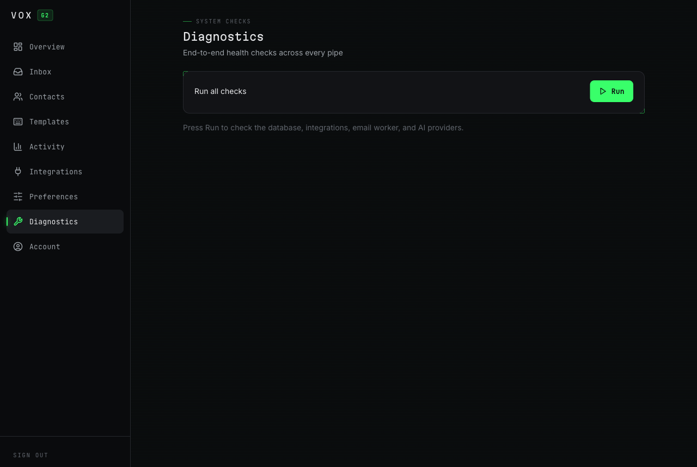
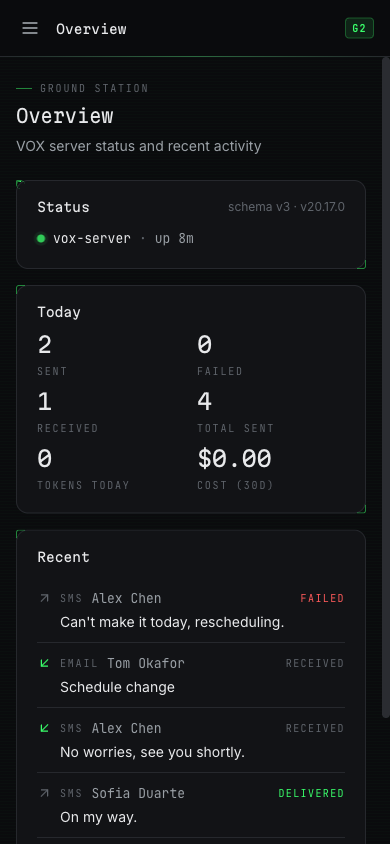
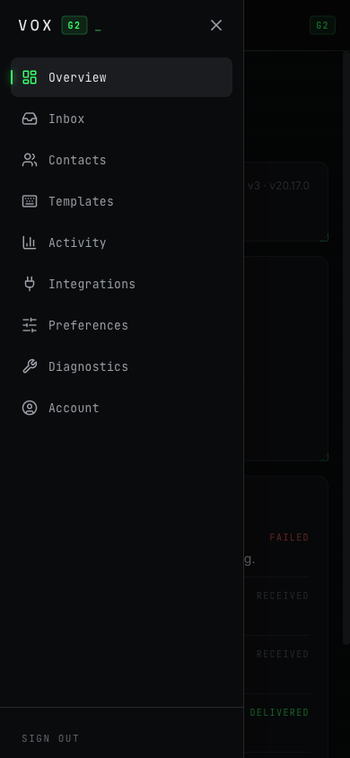
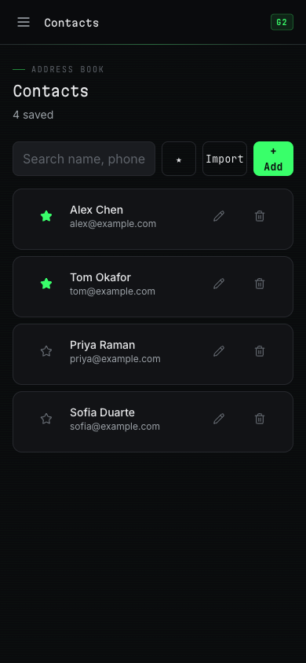

# The dashboard

Also referred to in this project as "the CRM". They are the same thing —
there is no separate CRM system. It is the React SPA in `web/`, served at
the root of the same domain as the API.

---

## Is it required?

**Yes, at least once.** The glasses have no keyboard, so credentials,
contacts and templates cannot be entered on the device. The dashboard is
where the system is configured.

Day to day it is optional — once set up, the glasses work on their own.

It deploys with the server, on the same box, behind the same Nginx. There
is no separate host, database or credential.

---

## How the two systems relate

There is no dashboard-specific backend. The dashboard is a static bundle
that calls the **same** `/api/*` endpoints the glasses call, with the same
bearer secret.

```
   glasses ─┐
            ├─► /api/*  ──►  server  ──►  SQLite
 dashboard ─┘        same endpoints, same auth, same data
```

That is why a message style set on the glasses appears in the dashboard
instantly, and vice versa: both are reading and writing `preferences` via
`GET`/`PUT /api/config`. There is no synchronisation layer because there is
nothing to synchronise.

---

## Authentication

Two ways in.

### Passkey-free, from the phone companion

The companion already holds the shared secret, so nothing needs typing:

```
 companion  ──POST /api/auth/handoff──►  server mints single-use token
     │                                    · 180 s TTL
     │                                    · only sha256(token) stored
     │                                    · secret stored encrypted on the row
     ▼
 opens /connect?t=<token>&from=<companion-url>
     │
     ▼
 dashboard exchanges once → stores the secret → strips the token from history
```

The token is burned inside the same transaction as the read, so two racing
exchanges cannot both succeed. Because the return URL travels in `?from=`,
the dashboard renders a **Back to VOX** control — without it the companion
WebView is replaced with no browser chrome and no way back.

### Manual

Paste the shared secret on the welcome screen. It is held in `localStorage`
and sent as `Authorization: Bearer` on every request. Sign out clears it.

**Connect another device** on the Account page shows a QR containing a
handoff URL with a live countdown — not the permanent secret. Scanning it
from a laptop signs that browser in once. An earlier version encoded
`{server, secret}` directly, which meant a photograph of that screen was
unlimited access, forever, undetectably.

---

## What each page does

Screenshots below are from a local instance seeded with fictional data —
no real contact, number or credential appears in any of them.

### Overview



The landing page, and the one screen that answers "is anything wrong?"
without a click.

- **Status** — service name, uptime, schema version and Node version, read
  from `/api/health`. This is the only card that carries the animated
  phosphor trace, because it is the only genuinely live surface. If the
  server is unreachable the trace stops and the card says so.
- **Today** — sent, failed, received, lifetime total, tokens consumed and
  30-day cost. Figures are tabular so they do not reflow as digits change.
- **Recent** — the last several messages, direction arrow, channel, contact
  and status. Outbound and inbound are interleaved, newest first.

If Twilio or a model provider is unconfigured, a **Finish setup** banner
appears above everything and links to the wizard.

### Inbox



Everything received, from both channels in one list. Inbound SMS arrives by
Twilio webhook; inbound email by a persistent IMAP IDLE connection, so
messages appear without polling.

Unread items are marked; opening one shows the full body and marks it read,
which clears the badge on the glasses too. The same records back the HUD
inbox — this is a view onto the same table, not a copy.

### Contacts



The address book, and **the reason voice compose can resolve a name at all**
— contact names are injected into the intent prompt as grounding, so "text
Alex" matches a record instead of guessing.

- Phone numbers normalise to E.164 on save; a contact with no reachable
  address is rejected rather than stored broken.
- What each contact can receive is shown plainly — `both`, `phone`, `email`
  — because that determines which channels the glasses will offer.
- Favourites sort first. Search filters as you type. CSV import takes
  `name,phone,email`.

### Templates

Reusable message bodies with explicit ordering; twelve are seeded on first
run. Stored and exposed via the API.

> Honest gap: templates are **not yet surfaced on the glasses.** They are
> manageable here and readable through the API, but no HUD screen consumes
> them.

### Activity



The full audit log — every send and receive, with the tone used and the
delivery status.

- **Roll-up** across the top: lifetime sent, received, failed, sent today,
  tokens, 30-day cost.
- Filter by channel and direction; export the filtered view as CSV.
- Status carries the emphasis (`DELIVERED`, `FAILED`); the tone is a
  footnote, because status is what you scan for.

Delivery status updates in place as Twilio's callbacks arrive, so a message
can move from `sent` to `delivered` after the fact.

### Integrations



Where credentials live. One card per provider — Twilio and the four model
providers — plus the email account.

- Credentials are encrypted with `MASTER_KEY` and stored in the database,
  which **takes precedence over environment variables**. If a value here
  and an env var disagree, this one wins.
- Each card shows a masked hint of what is configured and its source
  (`db` or `env`), never the secret itself.
- **Test** performs a real round trip against the provider, so a bad key is
  caught here rather than mid-message.
- The email account is configured separately, with SMTP and IMAP host,
  port and security. Gmail, Outlook and iCloud need an **app password**,
  not your account password.

### Preferences



Behaviour, auto-saved as you change it. The settings that reach the glasses:

| Setting | Effect on the glasses |
|---|---|
| `default_tone` | The style new messages start in. The same value the HUD Style menu writes. |
| `voice_language` | Language pinned for speech recognition. |
| `max_recording_seconds` | Hard cap on one recording. |
| `silence_autostop_seconds` | Silence before recording ends; `0` disables. |
| `rewrite_provider` / `rewrite_model` | Which model parses intent and writes the rewrites. |

**`voice_language` defaults to `en`, not auto-detect.** Given a free choice
on marginal audio, `whisper-1` will confidently return another language —
English in, Japanese out was a real reported bug. Set a specific language,
or `auto` if you genuinely need multilingual and accept that failure mode.

Remaining settings — daily limits, quiet hours, notification filters — are
stored and editable, but not all are consumed by the glasses yet.

### Diagnostics



One button that exercises every dependency: database, Twilio, SMTP, IMAP and
each configured model provider. Each check reports pass/fail with the
upstream error where there is one.

This is the fastest way to answer "is it VOX or is it the provider?", and
the first thing to run when something stops working.

### Account

Pairing and access.

- **Connect another device** — a QR containing a single-use handoff URL with
  a live countdown. Scanning it from a laptop signs that browser in once.
  It does **not** contain your passkey.
- **Shared secret** — masked, revealable, rotatable. Rotating invalidates
  the old secret immediately; the glasses app must be repacked with the new
  one or it stops authenticating.
- **Sign out** clears the stored secret from this browser.

### Setup wizard (`/setup`)

Six steps for a fresh install: welcome → Twilio → email account → AI
provider → contacts import → done. Each step saves and tests before
advancing, so you find out a credential is wrong at the step that owns it.

---

---

## Mobile

<p>



</p>

The dashboard is used primarily on a phone, because that is where the
companion's **Open dashboard** button leads. It is built mobile-first:

- Below `lg` the sidebar becomes a drawer behind a hamburger; the desktop
  rail returns at `lg`.
- Every interactive control clears a 44 px touch target on touch viewports.
- Form controls render at 16 px below `lg` — under that, iOS Safari zooms
  the viewport on focus and the user has to pinch back out on every field.
- Modals are bottom sheets on phones and centred dialogs from `sm` up. They
  track `visualViewport`, so the sheet lifts above the on-screen keyboard
  instead of sitting behind it, and the first field is focused on open.
- Gutters use `max(1rem, env(safe-area-inset-*))`, so the notch and the home
  indicator are respected without losing the designed margin.

Verified by measurement at 320 / 390 / 844 / 1440 px: no horizontal scroll,
no sub-44 px targets, no sub-16 px inputs.

---

## Legal pages

`/privacy/` and `/terms/` are plain static HTML in `web/public/`, outside the
SPA bundle deliberately — they must resolve without a passkey and without
JavaScript, since app-store reviewers and crawlers hit them cold.

The support address is not in the repository. Both pages carry a
`SUPPORT_EMAIL` placeholder that `web/deploy.sh` substitutes from
`VOX_SUPPORT_EMAIL` at deploy time.

---

## Building and deploying

```bash
cd web
npm ci
npm run dev        # :5173, set VITE_API_BASE to a deployed server
npm run build      # → dist/
bash deploy.sh     # build, substitute support email, rsync, reload nginx
```

In production `VITE_API_BASE` is empty: Nginx serves the bundle and proxies
`/api` on the same origin, so relative paths resolve.
